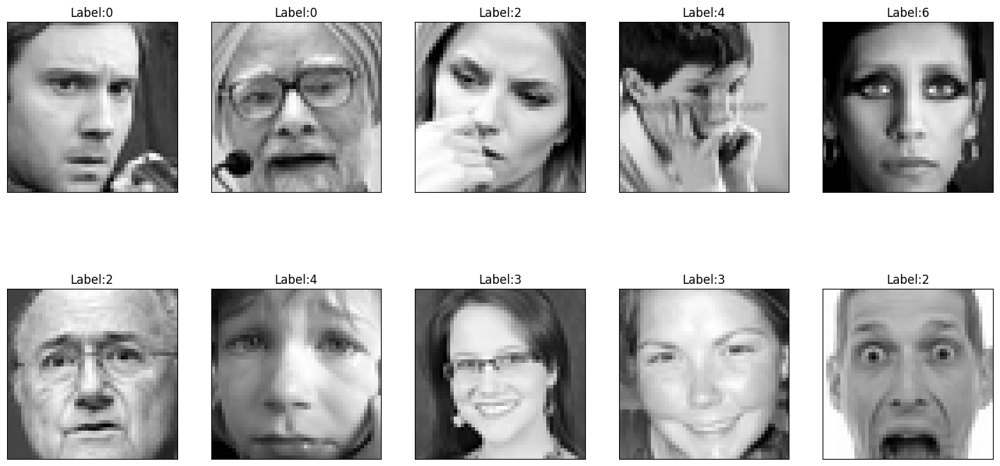
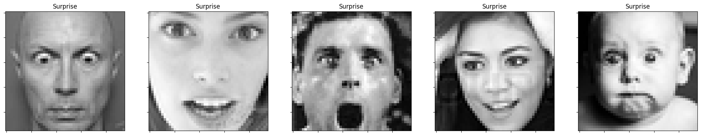
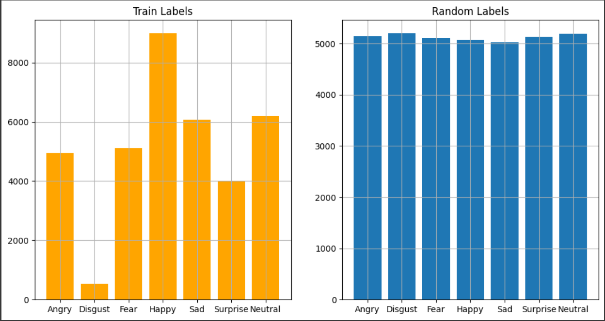

# Mini-Project for Fundamentals of Machine Learning Course

This repository contains the code and data for a mini-project on facial expression recognition using machine learning algorithms.

## 📑 Project Policy
- Team: group should consist of 3-4 students.

    |No.| Student Name    | Student ID |
    | --------| -------- | ------- |
    |1|Nguyễn Hoài Linh|21280097|
    |2|Trần Trịnh Mai Vy|21280122|
    |3|Trần Thị Bích Tuyền|21280059|
    |4|Nguyễn Thị Yến Như|21280082|

- The submission deadline is strict: **11:59 PM** on **June 22nd, 2024**. Commits pushed after this deadline will not be considered.

## 📦 Project Structure

The repository is organized into the following directories:

- **/data**: This directory contains the facial expression dataset. You'll need to download the dataset and place it here before running the notebooks. (Download link provided below)
- **/notebooks**: This directory contains the Jupyter notebook ```EDA.ipynb```. This notebook guides you through exploratory data analysis (EDA) and classification tasks.

## ⚙️ Usage

This project is designed to be completed in the following steps:

1. **Fork the Project**: Click on the ```Fork``` button on the top right corner of this repository, this will create a copy of the repository in your own GitHub account. Complete the table at the top by entering your team member names.

2. **Download the Dataset**: Download the facial expression dataset from the following [link](https://mega.nz/file/foM2wDaa#GPGyspdUB2WV-fATL-ZvYj3i4FqgbVKyct413gxg3rE) and place it in the **/data** directory:

3. **Complete the Tasks**: Open the ```notebooks/EDA.ipynb``` notebook in your Jupyter Notebook environment. The notebook is designed to guide you through various tasks, including:
    
    1. Prerequisite
    3. Principle Component Analysis
    4. Image Classification
    5. Evaluating Classification Performance 

    Make sure to run all the code cells in the ```EDA.ipynb``` notebook and ensure they produce output before committing and pushing your changes.

5. **Commit and Push Your Changes**: Once you've completed the tasks outlined in the notebook, commit your changes to your local repository and push them to your forked repository on GitHub.

## MINI PROJECT
### I.Tổng quan về đồ án
- Project nhận dạng biểu cảm khuôn mặt được thực hiện trên các hình ảnh khuôn mặt từ bộ dữ liệu
- Tập dữ liệu được tổng hợp từ internet, được thiết kế để phân loại biểu hiện khuôn mặt. Dữ liệu bao gồm các hình ảnh thang độ xám của khuôn mặt, mỗi hình ảnh có kích thước 48x48 pixel. Các khuôn mặt đã được tự động căn chỉnh để gần như ở giữa và chiếm một khu vực tương tự trong mỗi hình ảnh.
- Mục tiêu là sử dụng những thuật toán Machine Learning và Deep Learning để phân loại từng khuôn mặt dựa trên cảm xúc được thể hiện, gán nó vào một trong bảy loại cảm xúc (0=Tức giận, 1=Ghê tởm, 2=Sợ hãi, 3=Vui vẻ, 4=Buồn, 5=Bất ngờ, 6=Trung lập).
#### 1. Prerequisite
##### **1.1 Thông tin về dữ liệu:**
- Kết quả thu được từ data: tập dữ liệu bao gồm 35,887 dòng và 2 cột: emotion và pixels. Cột emotion chứa các giá trị số nguyên đại diện cho các loại cảm xúc, và cột pixels chứa các chuỗi ký tự đại diện cho các giá trị pixel của hình ảnh.
  
- **Các nhãn dữ liệu:**
   + Nhãn Angry:
     
   + Nhãn Disgust:
     
   + Nhãn Fear:
      
   + Nhãn Happy:
      
   + Nhãn Sad:
      
   + Nhãn Surprise:
      
   + Nhãn Neutral:
     
##### **1.2 Thực hiện các xử lí ban đầu:**
- Kiểm tra giá trị thiếu và dữ liệu trùng lặp
- Khi đó ta thấy rằng dữ liệu được cung cấp không có giá trị thiếu và có **1793** giá trị trùng lặp => cần drop giá trị trùng lặp.
##### **1.3 Trực quan dữ liệu ban đầu:**
  - Tổng quan phần trăm các nhãn trong dữ liệu:
      
  - Nhận xét về phân phối nhãn dữ liệu
     
    - **Train Labels**: ta nhận thấy sự mất cân bằng rõ rệt:
        - Nhãn "Happy" xuất hiện nhiều nhất (~8000).
        - Nhãn "Disgust" xuất hiện ít nhất (gần 0).
        - Nhãn "Fear", "Sad", và "Neutral" trung bình (~5000-7000).
        - Nhãn "Angry" và "Surprise" thấp hơn.
    - **Random Labels** có phân phối đồng đều: mọi nhãn có tần suất xuất hiện tương đương (~5000).
    - **So sánh chung**
        - **Train Labels**: Mất cân bằng giữa các nhãn.
        - **Random Labels**: Phân phối đều đặn.
    => **Kết luận**: Dữ liệu mất cân bằng trong tập huấn luyện bởi vì nhãn "Happy" quá phổ biến có thể gây thiên vị cho mô hình.
### IIII. Principal Components Analysis - PCA
- Một trong những ứng dụng phổ biến nhất của biến đổi dữ liệu không giám sát là giảm chiều dữ liệu. Quá trình này giảm số lượng đặc trưng (chiều) trong dữ liệu. Khi dữ liệu có số lượng đặc trưng lớn, việc phân tích có thể tốn kém về mặt tính toán và khó khăn. Các kỹ thuật giảm chiều dữ liệu giúp khắc phục những thách thức này.

- Phân Tích Thành Phần Chính (PCA) là một kỹ thuật phổ biến cho việc giảm chiều dữ liệu. Nó biến đổi dữ liệu thành một tập hợp mới của các đặc trưng gọi là các thành phần chính (PCs). Những PCs này được sắp xếp theo thứ tự quan trọng, nắm bắt các biến thể quan trọng nhất trong dữ liệu. Bằng cách chọn một tập hợp con của những PCs thông tin nhất, chúng ta có thể đạt được sự giảm kích thước dữ liệu đáng kể trong khi vẫn giữ lại thông tin cốt yếu cho việc phân tích.

#### **Câu hỏi 1: Can you visualize the data projected onto two principal components?**
- Hình ảnh khi trực quan dữ liệu về 2 chiều:

**Nhận xét**: Từ hình ảnh trên có thể thấy chúng ta không thể trực quan dữ liệu trên không gian hai chiều(n_componets = 2) vì không mang lại ý nghĩa nào về mặt trực quan đối với bộ dữ liệu.

#### **Câu hỏi 2:How to determine the optimal number of principal components using pca.explained_variance_? Explain your selection process.**
- Để xác định số lượng thành phần chính (principal components - PCs) tối ưu, ta cần xem xét tỷ lệ phương sai được giải thích (explained_variance_ratio_) bởi các PCs. Mục tiêu là chọn số lượng PCs sao cho giữ lại được phần lớn phương sai trong dữ liệu ban đầu mà không cần sử dụng quá nhiều PCs, giúp giảm chiều dữ liệu và cải thiện hiệu quả tính toán.
- Các bước thực hiện:
  + 1. **Khởi tạo PCA và tính toán:** Khởi tạo đối tượng PCA và áp dụng nó lên dữ liệu để 
    tính toán các PCs.
  + 2. **Tính toán phương sai tích lũy**: Sử dụng 
    ```np.cumsum(pca.explained_variance_ratio_)``` để tính toán tỷ lệ phương sai tích lũy 
    được giải thích bởi các PCs.
  + 3. **Vẽ Scree Plot**: Tạo biểu đồ Scree Plot để trực quan hóa tỷ lệ phương sai tích 
    lũy theo số lượng PCs.
  + 4. **Xác định điểm khuỷu (elbow point)**: Sử dụng logic để tìm điểm khuỷu, là điểm mà 
    sau đó tỷ lệ tăng của phương sai giải thích giảm đi đáng kể. Đây thường là dấu hiệu để 
    chọn số lượng PCs tối ưu.

  
  **Nhận xét**: Từ hình ảnh có thể thấy component tối ưu được chọn là **104**. Điều này có nghĩa là 104 PCs đầu tiên giải thích được 90% phương sai của dữ liệu ban đầu.
### **III.Model**
#### 1.1 Biến đổi dữ liệu trước khi apply model
##### a) **Chia tập dữ liệu thành train và test**
- Đây là bước chia dữ liệu ban đầu thành hai phần riêng biệt để huấn luyện mô hình và đánh giá hiệu suất của nó. Tập huấn luyện được sử dụng để mô hình học từ dữ liệu, trong khi tập kiểm tra dùng để đánh giá mô hình sau khi huấn luyện.\
- Với dữ liệu này tập train và test đã chia theo test_size=0.2 và random_state=42.
- Sau khi chia dữ liệu, các giá trị dữ liệu thô được chuyển đổi thành định dạng phù hợp để sử dụng trong mô hình. Ví dụ, trong trường hợp này, dữ liệu pixel ban đầu được chuyển từ chuỗi thành các mảng số nguyên để mô hình có thể hiểu và xử lý.

##### b) **Biến đổi dữ liệu**
Sau khi chia dữ liệu, các giá trị dữ liệu thô được chuyển đổi thành định dạng phù hợp để sử dụng trong mô hình. Ví dụ, trong trường hợp này, dữ liệu pixel ban đầu được chuyển từ chuỗi thành các mảng số nguyên để mô hình có thể hiểu và xử lý.
```python
from sklearn.decomposition import PCA
# Chọn số thành phần chính sao cho giữ lại ít nhất 90% phương sai của dữ liệu gốc
pca = PCA(n_components=104)
```
Dữ liệu đã được biến đổi bằng PCA (X_test_pca) được sử dụng để đánh giá hiệu suất của mô hình máy học sau khi đã được huấn luyện trên dữ liệu đã giảm chiều (X_train_pca). Việc này giúp đảm bảo rằng mô hình đang được đánh giá trên các dữ liệu có cùng phân phối với dữ liệu huấn luyện, sau khi đã áp dụng phương pháp giảm chiều dữ liệu PCA.
##### c) **Inverse data from pca**
Tiếp theo ta  sử dụng hàm inverse để phục hồi dữ liệu từ không gian giảm chiều (thông qua PCA) về không gian ban đầu. Nhằm để đánh giá:
- Đánh giá lại chất lượng của việc giảm chiều dữ liệu.
- Đối chiếu và so sánh các điểm dữ liệu giữa không gian ban đầu và không gian đã giảm chiều.
- Sử dụng dữ liệu phục hồi để đảm bảo rằng mô hình hoạt động hiệu quả trên các điểm dữ liệu gốc, không chỉ trên các điểm đã giảm chiều
```python
X_train_restored = pca.inverse_transform(X_train_pca)
X_test_restored = pca.inverse_transform(X_test_pca)
```
#### 1.2 Model 
##### a) Model GradientBoostingClassifier
 
Gradient boosting sử dụng một quy trình lặp lại để cập nhật mô hình. Công thức tổng quát cho mô hình ở bước \( m \) là:\
$$F_m(x) = F_{m-1}(x) + \nu \cdot h_m(x)$$ 

Trong đó:
- $F_m(x)$là mô hình tại bước \( m \).
- $F_{m-1}(x)$là mô hình tại bước trước đó.
- $(\nu)$ là tốc độ học (learning rate), một hệ số giảm để điều chỉnh mức độ ảnh hưởng của mỗi cây.
- $(h_m(x))$ là cây quyết định mới được huấn luyện để dự đoán phần dư (residuals) hoặc gradient của hàm mất mát tại bước \(m\).

Quá trình huấn luyện bao gồm các bước sau:
1. Khởi tạo mô hình với một giá trị không đổi:
   $F_0(x) = \arg\min_\gamma \sum_{i=1}^{N} L(y_i,\gamma)$
   Trong đó, $L$ là hàm mất mát và $(y_i)$ là nhãn thực tế.
2. Với mỗi bước $(m = 1)$ đến $M$:\
   a. Tính gradient của hàm mất mát:
   $$g_im = [∂L(y_i, F(x_i)) / ∂F(x_i)]  tại  F(x) = F_{m-1}(x)$$
   b. Huấn luyện cây quyết định $h_m(x)$ để dự đoán gradient $g_{im}$.\
   c. Cập nhật mô hình:\
      $F_m(x) = F_{m-1}(x) + \nu \cdot h_m(x)$
Quá trình này tiếp tục cho đến khi số bước \( M \) được hoàn thành hoặc mô hình đạt đến hiệu suất mong muốn.
- Model với dữ liệu gốc:
    - Best parameters found:  **{'learning_rate': 0.25, 'max_features': 48, 'n_estimators': 200}**
    - Với Accuracy of the best Gradient Boosting model cao nhất là:  0.4098841472356651
- Model với dữ liệu PCA
    - Best parameters found:  **{'learning_rate': 0.1, 'max_features': 24, 'n_estimators': 200}**
    - Accuracy of the best Gradient Boosting model: 0.37879454465464146
- Model với dữ liệu inverse
    - Best parameters found: **{'learning_rate': 0.25, 'max_features': 48, 'n_estimators': 200}**
    - Accuracy of the best Gradient Boosting model: 0.39917876521484086
##### b) Model XGBoost Classifier

Đặc điểm chính của XGBoost.

**Tối ưu hóa tốc độ và hiệu suất:**
* Tree Pruning: Sử dụng chiến lược cắt tỉa cây (pruning) để tránh overfitting, với kỹ thuật "maximum depth".
* Parallel Processing: Hỗ trợ xử lý song song để tăng tốc độ huấn luyện.
* Cache-aware Access: Tối ưu hóa truy cập bộ nhớ cache để tăng hiệu suất tính toán. \

**Regularization (Điều chỉnh):** \
* XGBoost thêm các thuật ngữ điều chỉnh vào hàm mất mát để tránh overfitting, cụ thể là L1 (lasso) và L2 (ridge) regularization.

**Handling Missing Values:**
* Tự động xử lý các giá trị thiếu (missing values) bằng cách học các con đường tối ưu trong cây quyết định.

**Shrinkage (Learning Rate):**
* Hỗ trợ giảm tốc độ học (learning rate), giúp làm chậm quá trình học và cải thiện khả năng tổng quát hóa của mô hình.

**Early Stopping:**
* XGBoost hỗ trợ dừng sớm khi mô hình không còn cải thiện trên tập kiểm tra, giúp tiết kiệm thời gian và tránh overfitting.

**Cross Validation:**
* Hỗ trợ k-fold cross validation tích hợp để đánh giá mô hình và chọn siêu tham số tối ưu.
##### c) Model Logistic Regreesion
##### d) Model SVM
##### e) Model Multi-layer Perceptron classifier


